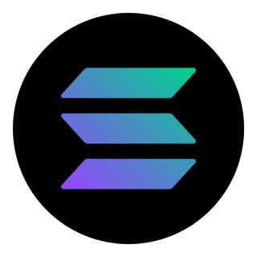

<html lang="en">
  <head>
    <meta charset="UTF-8" /> 
    <meta name="viewport" content="width=device-width, initial-scale=1.0" />
  </head>
  <body style="background-color: pink; margin: 0; font-family: Arial, sans-serif; color: #333;">
    <header style="background-color: #fff; padding: 20px; text-align: center; box-shadow: 0 2px 4px rgba(0,0,0,0.1);">
  <h1 style="margin: 0; font-size: 32px;">web3 WFH-HOLDERSH</h1>
  <nav style="margin-top: 10px;">
    <a href="https://web3autotrades.cc/account/dashboard" style="margin: 0 15px; text-decoration: none; color: #333; font-weight: bold;">Home</a>
    <a href="https://www.tradingview.com/symbols/BTCUSD/" style="margin: 0 15px; text-decoration: none; color: #333; font-weight: bold;">Market</a>
    <a href="https://web3autotrades.cc/account/dashboard/trade" style="margin: 0 15px; text-decoration: none; color: #333; font-weight: bold;">Portfolio</a>
    <a href="https://wa.me/12722764080" target="_blank" style="margin: 0 15px; text-decoration: none; color: #333; font-weight: bold;">Contact</a>
    
  
       
        
                       <!-- Registration Button -->
   <a 
          href="https://web3autotrades.cc/account/signup" 
          target="_blank" 
          style="margin: 0 15px; text-decoration: none; padding: 8px 12px; background-color: #007bff; color: #fff; border-radius: 4px; font-weight: bold;">
          Register
        </a>
       </nav>
    </header>
    
  <main style="max-width: 1000px; margin: 30px auto; background-color: #fff; padding: 20px; border-radius: 8px; box-shadow: 0 2px 4px rgba(0,0,0,0.1);">
      <section>
        
        <!-- Main Content -->
  <main style="max-width: 1000px; margin: 30px auto; background-color: #fff; padding: 20px; border-radius: 8px; box-shadow: 0 2px 4px rgba(0,0,0,0.1);">
      <section>
        <!-- Bitcoin Card -->
        

          

            <h2 id="bitcoin" style="margin: 0; font-size: 24px;">
               
              Bitcoin
              
            </h2>
            
$--

          

          

            <a href="https://www.blockchain.com/charts/market-price" target="_blank" style="text-decoration: none; padding: 8px 12px; background-color: #e0e0e0; color: #333; border-radius: 4px; font-size: 14px;">View Details</a>
          

        

        <!-- Ethereum Card -->
  

          

            <h2 id="ethereum" style="margin: 0; font-size: 24px;">
               
              Ethereum
              
            </h2>
            
$--

          

          

            <a href="https://etherscan.io/chart/etherprice" target="_blank" style="text-decoration: none; padding: 8px 12px; background-color: #e0e0e0; color: #333; border-radius: 4px; font-size: 14px;">View Details</a>
          

        

        <!-- Tether (USDT) Card -->
  

          

            <h2 id="usdt" style="margin: 0; font-size: 24px;">
               
              Tether (USDT)
              
            </h2>
            
$--

          

          

            <a href="https://etherscan.io/token/0xdAC17F958D2ee523a2206206994597c13d831ec7" target="_blank" style="text-decoration: none; padding: 8px 12px; background-color: #e0e0e0; color: #333; border-radius: 4px; font-size: 14px;">View Details</a>
          

        

        <!-- Solana Card -->
  

          

            <h2 id="solana" style="margin: 0; font-size: 24px;">
               
              Solana
              
            </h2>
            
$--

          

          

            <a href="https://explorer.solana.com" target="_blank" style="text-decoration: none; padding: 8px 12px; background-color: #e0e0e0; color: #333; border-radius: 4px; font-size: 14px;">View Details</a>
          

        

        <!-- Binance Coin (BNB) Card -->
  

          

            <h2 id="bnb" style="margin: 0; font-size: 24px;">
               
              Binance Coin (BNB)
              
            </h2>
            
$--

          

          

            <a href="https://bscscan.com/chart/bnb" target="_blank" style="text-decoration: none; padding: 8px 12px; background-color: #e0e0e0; color: #333; border-radius: 4px; font-size: 14px;">View Details</a>

   

  

        

      </section>
    </main>
    
    <!-- JavaScript: Fetch current prices for each token from CoinGecko -->
    
  
    
